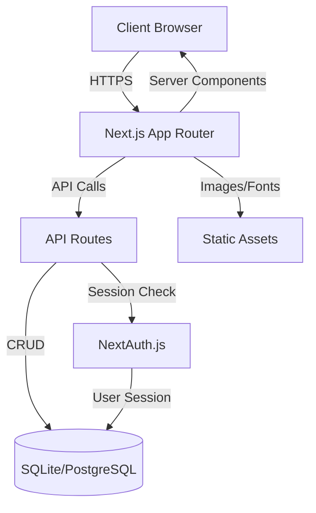
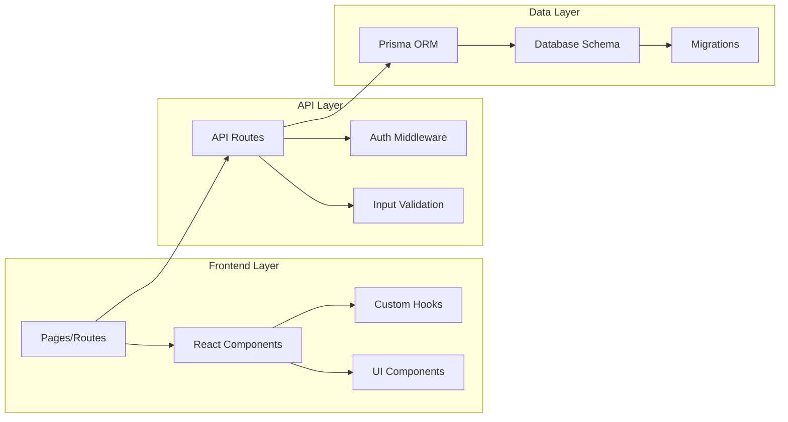
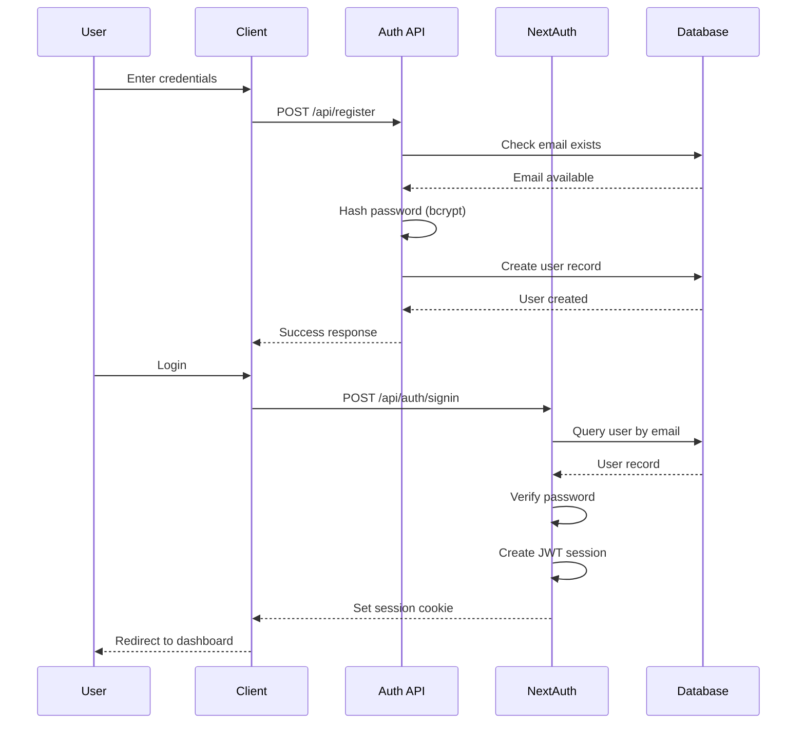
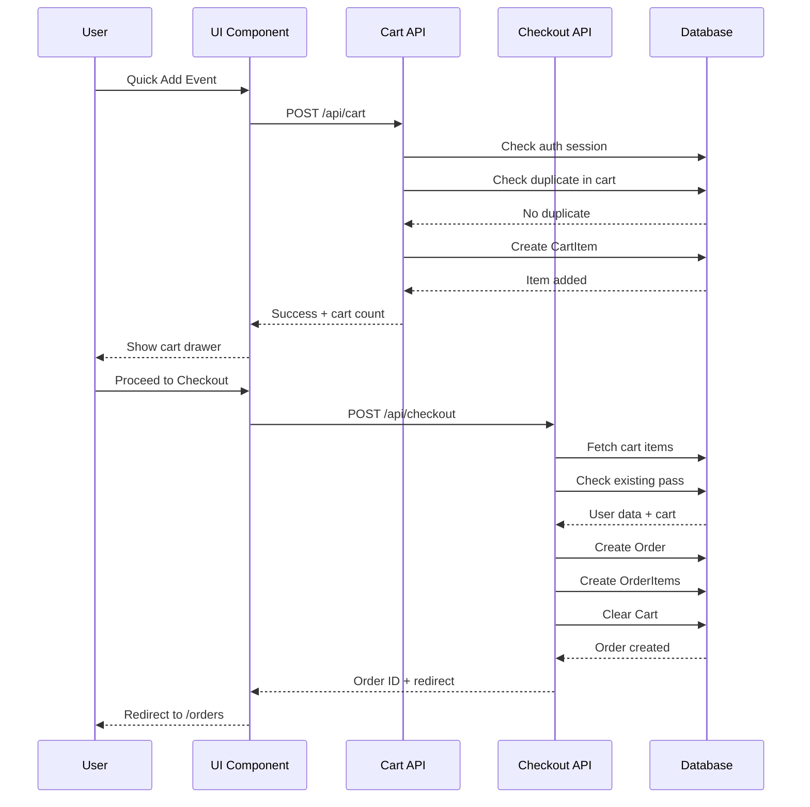
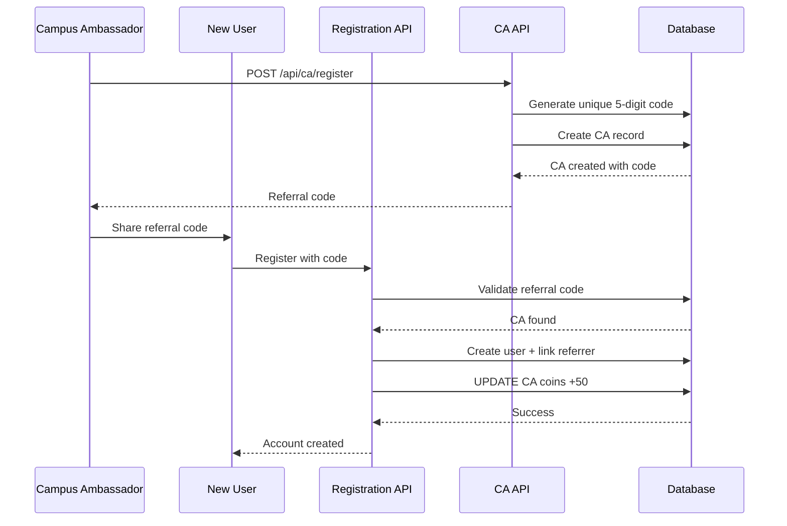
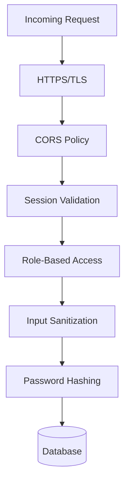
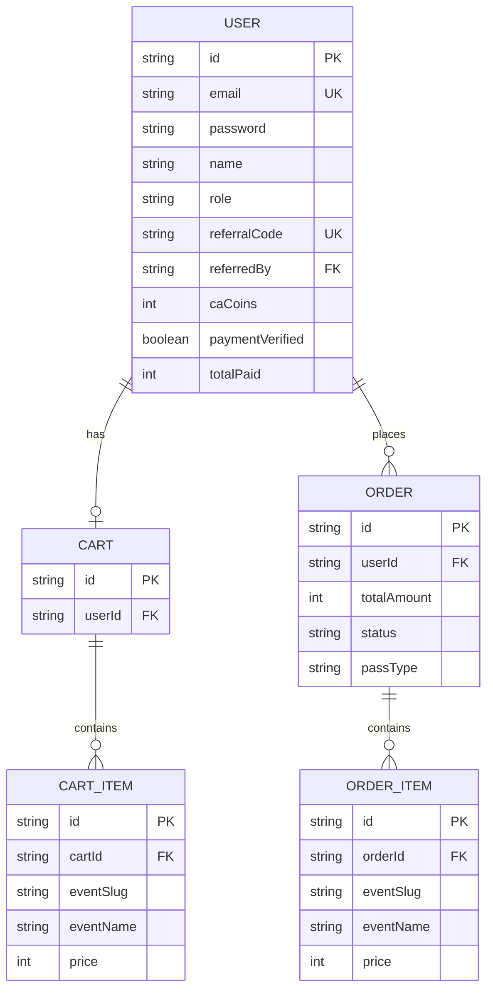

# Encore 26 | Nawabi Elegance

A comprehensive fest management platform for IET Lucknow's annual cultural fest. Built with Next.js, Prisma, and modern web technologies to deliver a premium user experience.

## �️ System Architecture

### High-Level Overview



### Component Architecture

The application follows a **modular, feature-based architecture** with clear separation of concerns:



### Data Flow Architecture

#### 1. User Registration & Authentication Flow



#### 2. Event Registration & Checkout Flow



#### 3. Campus Ambassador (CA) Referral Flow



### Technical Design Patterns

#### 1. **Server-Side Rendering (SSR) & React Server Components**
- Pages are rendered on the server for optimal performance
- Client components (`"use client"`) only where interactivity is needed
- Reduces JavaScript bundle size and improves SEO

#### 2. **API Route Handlers (Back-end for Front-end)**
- Centralized business logic in `/app/api` routes
- Protected routes use NextAuth session checking
- Consistent response format: `{ success, data?, error? }`

#### 3. **Repository Pattern (via Prisma)**
- Database operations abstracted through Prisma Client
- Type-safe queries with TypeScript
- Automatic migrations for schema changes

#### 4. **Component Composition**
- Small, reusable UI components (`Button`, `Modal`, `Input`)
- Feature-specific components (`CartDrawer`, `ProfileModal`)
- Layout components (`Navbar`, `Footer`)

#### 5. **State Management Strategy**
- **Server State**: Fetched via API routes, cached by React
- **Client State**: React `useState` for local UI state
- **Global Events**: `CustomEvent` for cart updates across components
- **Session State**: NextAuth session provider

### Security Architecture



**Security Layers:**
1. **Transport Security**: HTTPS enforced in production
2. **Authentication**: JWT-based sessions via NextAuth
3. **Authorization**: Role checking (USER, CA, ADMIN)
4. **Input Validation**: Server-side validation on all endpoints
5. **Password Security**: bcrypt with 10 salt rounds
6. **SQL Injection Prevention**: Parameterized queries via Prisma
7. **XSS Protection**: React's automatic escaping + CSP headers

### Database Schema Design



### Scalability Considerations

1. **Database**: SQLite for development, PostgreSQL/MySQL for production
2. **Caching**: Static pages cached at CDN edge (Vercel)
3. **Image Optimization**: Next.js Image component with automatic WebP conversion
4. **Code Splitting**: Automatic route-based code splitting
5. **API Pagination**: Ready for implementation on leaderboard/user lists

## �🌟 Features

### 🎭 Event Management
- **Event Categorization**: Events organized by club categories (Dance, Music, Dramatics, Fine Arts, Photography/Film, Literary, Business)
- **Event Details**: Rich event pages with descriptions, rules, pricing, dates, and venue information
- **Quick Add to Cart**: One-click event registration from event cards
- **Event Image Gallery**: Visual representation of all events with themed imagery

### 🛒 Shopping Cart & Checkout
- **Slide-over Cart Drawer**: Modern, accessible cart interface with real-time updates
- **Smart Checkout Flow**: Multi-step checkout process with glassmorphism design
- **Fest Pass Options**: 
  - Basic Pass (₹399): 3-day access + concert entry
  - Premium Pass (₹999): All access + 3-day accommodation + meals
- **Pass Detection**: Automatic detection of existing passes to prevent double charging
- **UPI/QR Payment**: Streamlined online payment via UPI
- **Order Management**: Complete order history with payment status tracking

### 👤 User Authentication & Profile
- **Email/Password Authentication**: Secure credential-based login powered by NextAuth.js
- **Profile Management**: Editable user profiles with college, year, phone, and accommodation preferences
- **Dashboard**: Personalized user dashboard with profile completion prompts
- **Session Management**: Secure session handling with automatic redirects

### 🎯 Campus Ambassador (CA) Program
- **CA Registration**: Dedicated portal for Campus Ambassador sign-ups
- **Unique Referral Codes**: Auto-generated 5-digit numeric referral codes
- **Referral Tracking**: Real-time tracking of referred users
- **Nawabi Coins**: Reward system for successful referrals (+50 coins per referral)
- **CA Leaderboard**: Public leaderboard showcasing top Campus Ambassadors with manual scrolling

### 💰 Nawabi Coins Reward System
Users earn coins for completing tasks:
- **Social Media Tasks**: 
  - Follow on Instagram: +20 coins
  - Connect on LinkedIn: +20 coins
  - Follow on X (Twitter): +20 coins
  - Like on Facebook: +20 coins
- **Cart Milestones**:
  - Add 1 event: +10 coins
  - Add 5 events: +25 coins
  - Add 10 events: +50 coins

### 🔐 Admin Panel
- **User Management**: View, edit, and delete user accounts
- **Payment Verification**: Verify payment screenshots and update payment status
- **User Search**: Quick search functionality to find users
- **Password Reset**: Secure password reset capability for users
- **Detailed User View**: Modal with complete user information, cart contents, and order history

### 📊 Public Leaderboard
- **CA Rankings**: Display all Campus Ambassadors ranked by referral count
- **Real-time Updates**: Live data from API endpoint
- **Manual Scroll**: Hover to scroll through the complete leaderboard
- **Responsive Design**: Optimized for all screen sizes

### 🎨 Premium UI/UX
- **Nawabi Theme**: Royal Lucknow-inspired design with gold accents and elegant typography
- **Glassmorphism**: Modern glass-effect cards and modals
- **Smooth Animations**: Framer Motion-powered transitions
- **Custom Fonts**: Cinzel and Marcellus for elegant headings
- **Responsive Design**: Mobile-first approach with Tailwind CSS
- **Dark Theme**: Default dark mode with noise texture overlay

## 🚀 Tech Stack

### Frontend
- **Next.js 15**: React framework with App Router
- **React 19**: Latest React features
- **TypeScript**: Type-safe development
- **Tailwind CSS**: Utility-first styling
- **Framer Motion**: Animation library
- **Lucide React**: Icon system

### Backend
- **Next.js API Routes**: Serverless API endpoints
- **NextAuth.js**: Authentication solution
- **Prisma ORM**: Database management
- **SQLite**: Development database (production can use PostgreSQL/MySQL)
- **bcrypt**: Password hashing

### Development Tools
- **ESLint**: Code linting
- **Prettier**: Code formatting
- **Git**: Version control

## 📦 Installation

### Prerequisites
- Node.js 18+ 
- npm/yarn/pnpm

### Setup

1. **Clone the repository**
   ```bash
   git clone <repository-url>
   cd encore26
   ```

2. **Install dependencies**
   ```bash
   npm install
   ```

3. **Configure environment variables**
   Create a `.env` file in the root directory:
   ```env
   # Database
   DATABASE_URL="file:./dev.db"
   
   # NextAuth
   NEXTAUTH_URL="http://localhost:3000"
   NEXTAUTH_SECRET="your-secret-key-here"
   
   # Admin
   ADMIN_SECRET="your-admin-secret-here"
   ```

4. **Initialize database**
   ```bash
   npx prisma generate
   npx prisma migrate dev
   ```

5. **Run development server**
   ```bash
   npm run dev
   ```

6. **Open in browser**
   Navigate to [http://localhost:3000](http://localhost:3000)

## 📁 Project Structure

```
encore26/
├── app/                          # Next.js App Router
│   ├── (auth)/                  # Auth-related pages
│   ├── about/                   # About page
│   ├── admin/                   # Admin panel
│   ├── api/                     # API routes
│   │   ├── admin/              # Admin APIs
│   │   ├── auth/               # NextAuth config
│   │   ├── ca/                 # CA registration
│   │   ├── cart/               # Cart management
│   │   ├── checkout/           # Checkout processing
│   │   ├── public/             # Public APIs
│   │   └── user/               # User APIs
│   ├── ca-portal/              # CA dashboard
│   ├── cart/                   # Cart page
│   ├── checkout/               # Checkout page
│   ├── dashboard/              # User dashboard
│   ├── events/                 # Event pages
│   │   └── [slug]/            # Dynamic event details
│   ├── leaderboard/            # Public leaderboard
│   └── orders/                 # Order history
├── components/                  # React components
│   ├── cart/                   # Cart components
│   ├── dashboard/              # Dashboard widgets
│   ├── home/                   # Homepage sections
│   ├── layout/                 # Layout components
│   ├── onboarding/             # Auth forms
│   └── ui/                     # Reusable UI components
├── lib/                        # Utilities and data
│   └── data.ts                 # Event data
├── prisma/                     # Database
│   ├── schema.prisma           # Database schema
│   └── migrations/             # Migration history
├── public/                     # Static assets
│   └── images/                 # Images and icons
└── styles/                     # Global styles
```

## 🗄️ Database Schema

### User
- Authentication (email, password)
- Profile (name, gender, phone, college, year)
- Payment info (paymentId, screenshot, verification status)
- CA fields (role, referralCode, caCoins)
- Social task completion flags
- Accommodation preferences

### Cart & CartItem
- User-specific shopping carts
- Event items with pricing
- Duplicate prevention

### Order & OrderItem
- Order history
- Payment status tracking
- Event ticket details
- Fest pass type

## 🎯 Key API Endpoints

### Public
- `GET /api/public/leaderboard` - CA leaderboard data

### Authentication
- `POST /api/auth/[...nextauth]` - NextAuth handlers
- `POST /api/register` - User registration

### User
- `POST /api/user` - Get user data
- `PUT /api/user` - Update profile
- `POST /api/user/claim` - Claim task rewards

### Cart & Orders
- `GET /api/cart` - Get cart items
- `POST /api/cart` - Add to cart
- `DELETE /api/cart` - Remove from cart
- `POST /api/checkout` - Create order
- `GET /api/orders` - Get order history

### Admin (Protected)
- `GET /api/admin/users` - List all users
- `PUT /api/admin/users` - Update user
- `DELETE /api/admin/users` - Delete user
- `GET /api/admin/leaderboard` - CA statistics

### CA Portal
- `POST /api/ca/register` - CA registration

## 🎨 Design System

### Colors
- **Primary (Gold)**: `#D4AF37`
- **Background**: `#000000`, `#050505`
- **Text**: `#FFFFFF`, `#E5E5E5`, `#A0A0A0`
- **Accents**: Purple (`#9333EA`) for premium features

### Typography
- **Headings**: Cinzel (serif)
- **Subheadings**: Marcellus (serif)
- **Body**: System font stack

### Components
- Glassmorphism cards with `backdrop-blur`
- Gold accent borders and highlights
- Smooth hover transitions
- Modal overlays with backdrop blur

## 🚢 Deployment

### Environment Setup
1. Update `NEXTAUTH_URL` to production URL
2. Configure production database (PostgreSQL/MySQL recommended)
3. Set secure `NEXTAUTH_SECRET` and `ADMIN_SECRET`

### Database Migration
```bash
npx prisma migrate deploy
npx prisma generate
```

### Build
```bash
npm run build
npm start
```

## 🔒 Security Features
- Bcrypt password hashing (10 rounds)
- NextAuth session management
- Admin route protection with secret key
- SQL injection prevention via Prisma
- Environment variable protection via `.gitignore`

## 📝 License
This project is proprietary software for IET Lucknow's Encore 26 fest.

## 👥 Contributors
Developed for Encore 26 - IET Lucknow's Annual Cultural Fest

----

**Encore 26 | Nawabi Elegance** - Where Culture Meets Technology
# main-encore-ietlucknow
